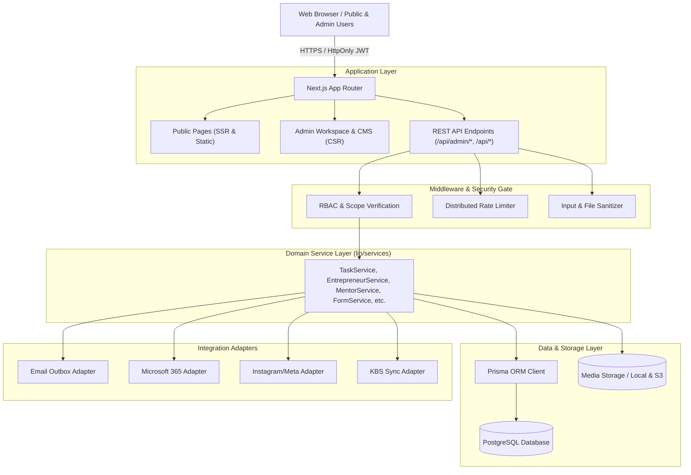

# İKÜANTS TEKMER — SYSTEM ARCHITECTURE DOCUMENT

## 1. System Overview

İKÜANTS TEKMER Digital Operating System is a unified, high-performance web platform that bridges two primary operational paradigms:
1. **Public Digital Experience**: A world-class, institutional and technology-driven showcase for İstanbul Kültür University Technology Center (TEKMER), its incubation programs (ANTSPARK, ANTSFire, Glow Up), entrepreneurs, mentors, events, and opportunities.
2. **Internal Digital Operations Platform**: An enterprise-grade Super Admin CMS, CRM, and Work Management Suite delivering Kanban task boards, daily agenda ("Benim Günüm"), calendar, activities, grant/project tracking, management intelligence reporting, granular RBAC, and integration adapters.

---

## 2. Technology Stack

- **Framework**: Next.js 16 (App Router, Server Components & Server Actions)
- **Language**: TypeScript 5 (Strict Mode)
- **Database & ORM**: PostgreSQL with Prisma ORM 6 (Supported locally with Embedded Postgres and Remote RDS/Neon)
- **Styling & Design System**: Tailwind CSS v4 + Vanilla CSS Design Tokens (Custom HSL Dark & Light Themes)
- **Animation & Motion**: Framer Motion 12 (Purposeful, subtle transitions with `prefers-reduced-motion` compliance)
- **Authentication & Security**: Jose (JWT & Secure HttpOnly cookies), Bcryptjs, RFC 6238 TOTP Multi-Factor Authentication, Distributed In-Memory Rate Limiting
- **Reporting & Data Export**: SheetJS (XLSX), Native CSV with formula injection sanitization, PDF layout generation
- **Testing**: Node.js Native Test Runner (`--test`), Playwright E2E Suite, Automated Unit & Security Test Suites

---

## 3. High-Level Architecture Diagram

---

## 4. Key Architectural Patterns

### 4.1. Domain Service Layer
All data mutations and database queries pass through strongly typed TypeScript domain services in `lib/services/`. This ensures:
- Single Source of Truth for validation and business logic.
- Automated Audit Logging for all mutating operations.
- Data encapsulation preventing direct Prisma calls in UI components.

### 4.2. Dual-Layer Content & Fallback
The public website features dynamic CMS rendering from database records with seamless static fallback (`data/content.ts`). If database connectivity is degraded or table records are empty, public visitors experience zero downtime or layout breakage.

### 4.3. Asynchronous Outbox Pattern
Transactional emails and notification deliveries utilize the `EmailOutbox` table pattern. Emails are staged within DB transactions, processed by asynchronous workers, and support exponential backoff retries without blocking HTTP requests or leaking PII.

### 4.4. Granular RBAC & Field Security
Roles (`SUPER_ADMIN`, `ADMIN`, `CONTENT_EDITOR`, `APPLICATION_MANAGER`, `MENTOR_MANAGER`, `PROGRAM_MANAGER`, `EVENT_MANAGER`, `PROJECT_MANAGER`, `VIEWER`) map to granular `resource:action` permissions with scope levels (`SELF`, `ASSIGNED`, `TEAM`, `PROGRAM`, `ALL`). Sensitive fields are filtered server-side prior to API response serialization.
